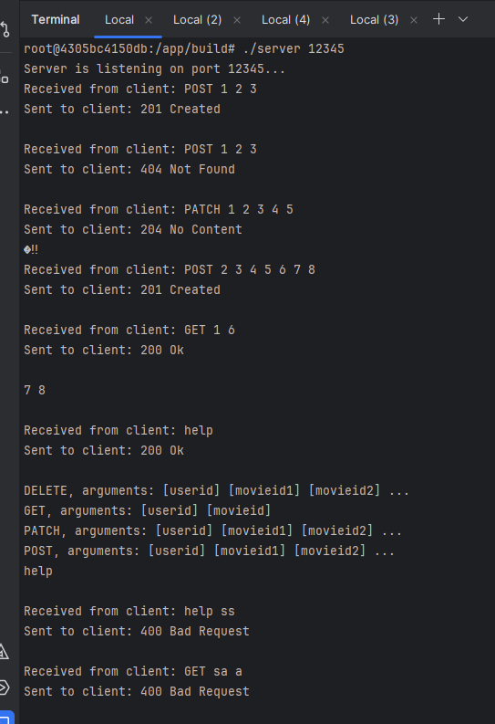
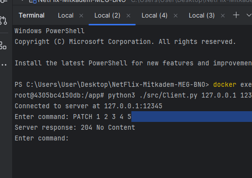
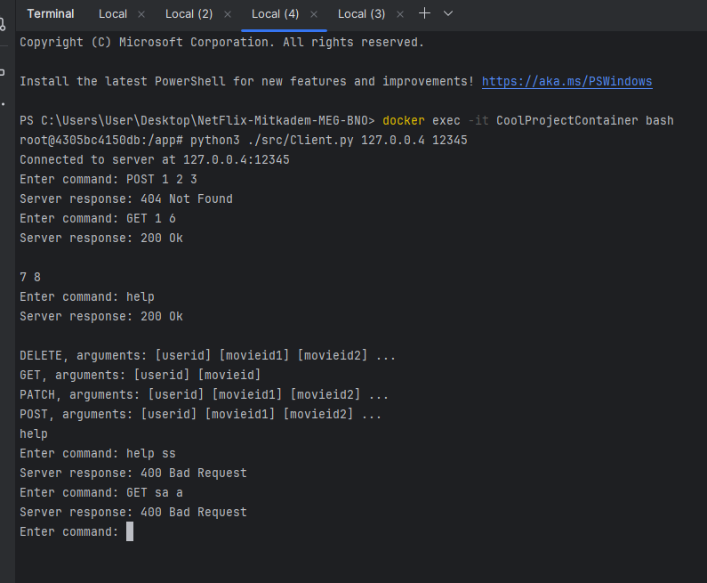
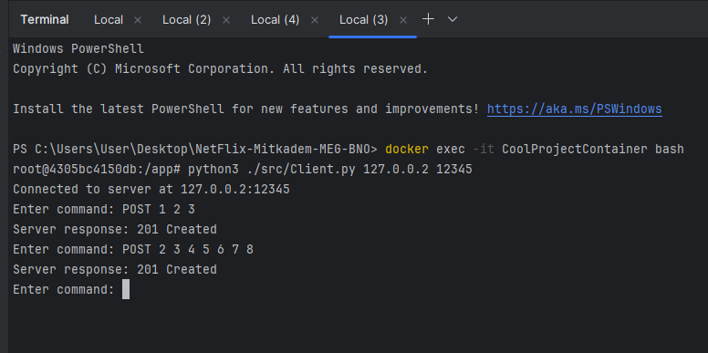
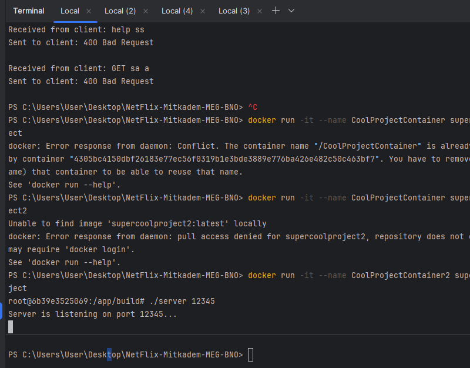
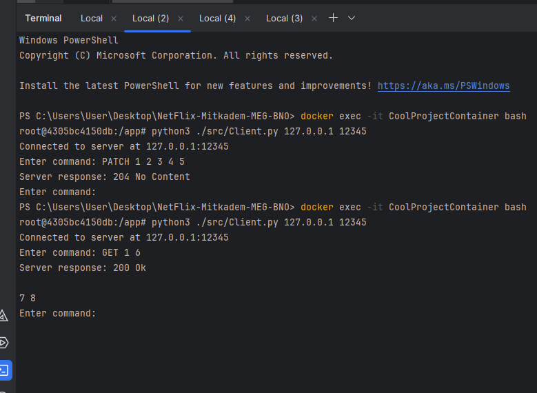
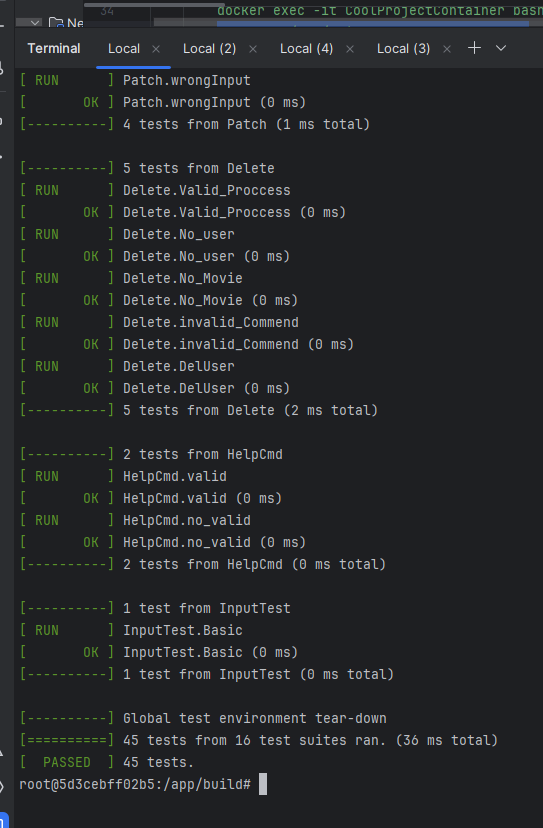

# NetFlix-Mitkadem-MEG-BNO
third part of the project.

---------------------------------------------------------------------------------------------------------------------------------------------------------------------------------------------------------------------

### updates:
- pogram now running on New Node.js server , using RESTful API and mongoDB data base.
- old server now is use as recommendation system.
- The recommendation server is now using a thread pool instead of multi-threading (3 threads).

-------------------------------------------------------------------------------------------------------------------------------------------------------------------------------------------------------------------------------------------------------------------------
### Each command in the recommendation system was encapsulated as a separate class to adhere to the Command Design Pattern.

Application Commands:
- help: Provides a list and explanation of all available commands in the application.
- GET: Accepts a userid and a movieid as inputs and generates up to 10 movie recommendations based on user similarities.
- POST/PATCH: Accepts a userid and at least one movieid and associates the specified movies with the user in the system only if
   the user is not/already exists.
- DELETE: Accepts a userid and at least one movieid and delete the movies from the user watchlist.
  
*Invalid or unsupported commands are met with a corresponding error message.
  
----------------------------------------------------------------------------------------------------------------------------------------------------------------------------------------------------------------------------------------------------------------------------
### The new Node.js application was implemented using the MVC structure.

Alow the flowing roots:
- http://localhost:3000/api/users
    suport: POST
- http://localhost:3000/api/users/:id
    suport: GET
  - http://localhost:3000/api/tokens
    suport: POST 
  - http://localhost:3000/api/categories
    suport: GET , POST
- http://localhost:3000/api/categories/:id
    suport: GET , PATCH ,DELETE
  - http://localhost:3000/api/movies
    suport: GET , POST
- http://localhost:3000/api/movies/:id
    suport: GET , PUT ,DELETE
  - http://localhost:3000/api/movies/:id/recommend/
    suport: GET , POST
- http://localhost:3000/api/search/:query/
    suport: GET
  
*Invalid or unsupported roots are met with a corresponding error message.
  
----------------------------------------------------------------------------------------------------------------------------------------------------------------------------------------------------------------------------------------------------------------------------

### program testing and running instractions:

    to build the project :
        docker-compose build
        docker-compose up -d
    to run cpp tests:
        docker exec -it netflix-mitkadem-meg-bno-cpp-1 /bin/bash
        cd build
        ./Tests

    to run the cpp server:
       docker exec -it netflix-mitkadem-meg-bno-cpp-1 /bin/bash
       cd build
       ./server 12345 

    to run the nodejs:
        docker exec -it netflix-mitkadem-meg-bno-nodejs-1 /bin/bash
        cd nodejs
        npm start

----------------------------------------------------------------------------------------------------------------------------------------------------------------------------------------------------------------------------------------------------------------------------

(For the clearty we made the running test with enter command and server respose, at the actual project we not printing it as the guide says)
### running examples:

regular run:

exiting the app and returning:

tests runs:

----------------------------------------------------------------------------------------------------------------------------------------------------------------------------------------------------------------------------------------------------------------------------

