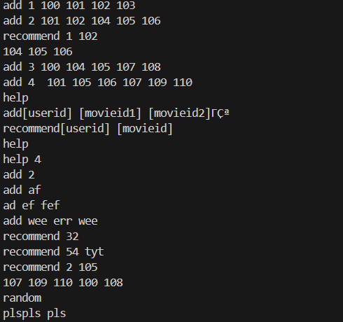
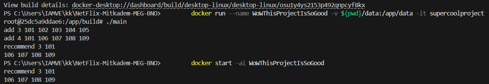

# NetFlix-Mitkadem-MEG-BNO

first part of the project.

Each command was encapsulated as a separate class to adhere to the Command Design Pattern.

Application Commands:
- Help: Provides a list and explanation of all available commands in the application.

- Recommend: Accepts a userid and a movieid as inputs and generates up to 10 movie recommendations based on user similarities.

- Add: Accepts a userid and at least one movieid and associates the specified movies with the user in the system.

* Invalid or unsupported commands were explicitly skipped, as per the project requirements.

running examples:
regular run:

exiting the app and returning:

program testing and running instractions:
    to build the project :)-
    
        docker build -t supercoolproject .

    to run the tests:

        docker run -it supercoolproject
        ./Tests

    to run the main first time(after ctr+c or any way you get out of container):

        docker run --name WoWThisProjectIsSoGood -v ${pwd}/data:/app/data -it supercoolproject
        ./main

    to run the main after first time(after ctr+c and ctr+z or any way you get out of container):

        docker start -ai WoWThisProjectIsSoGood
