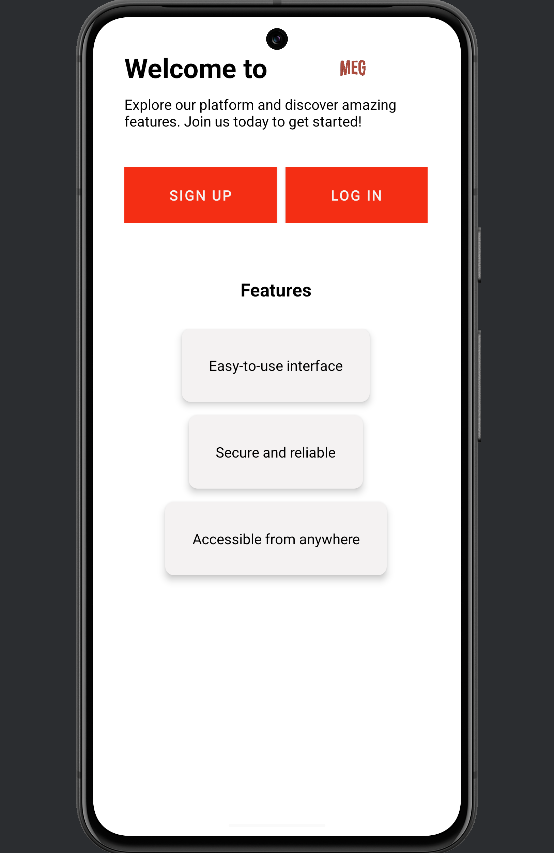
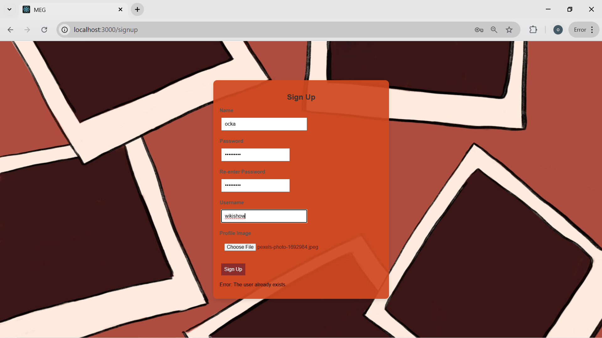
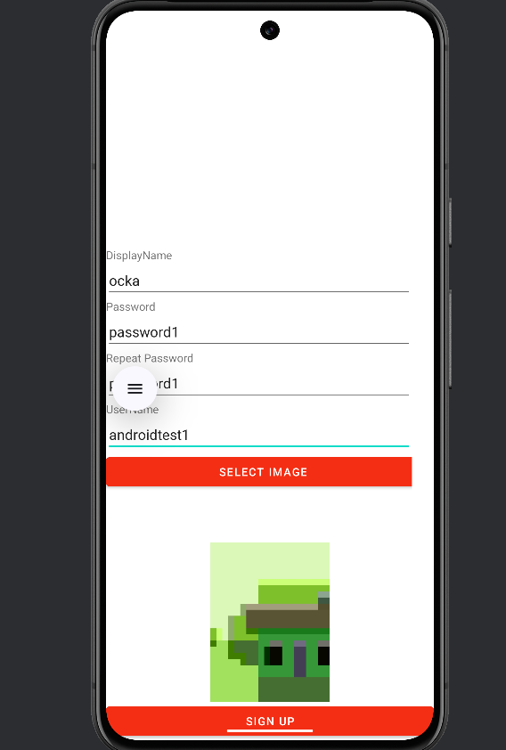
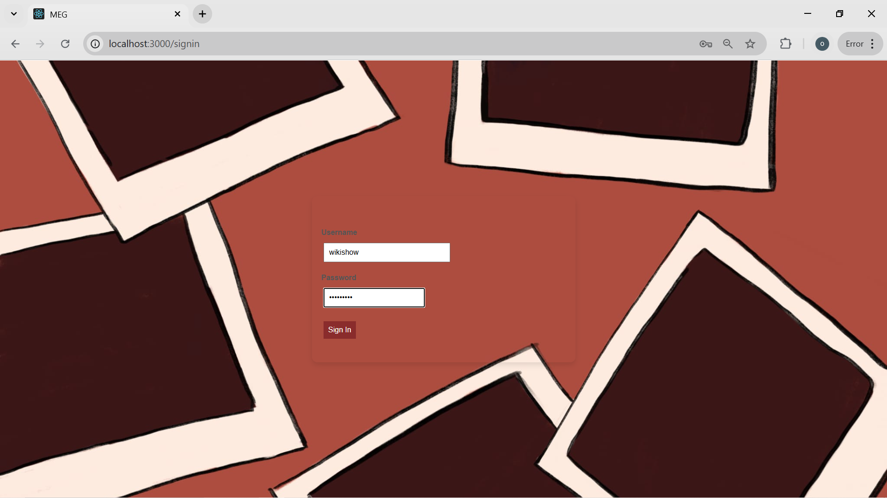
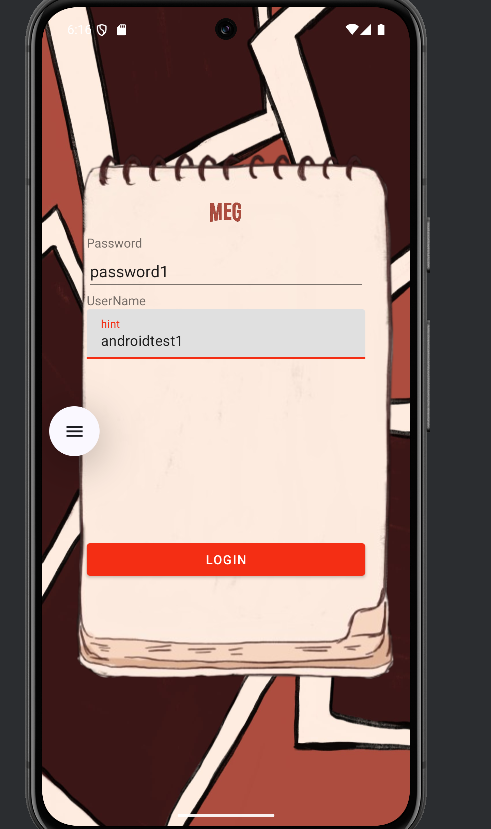
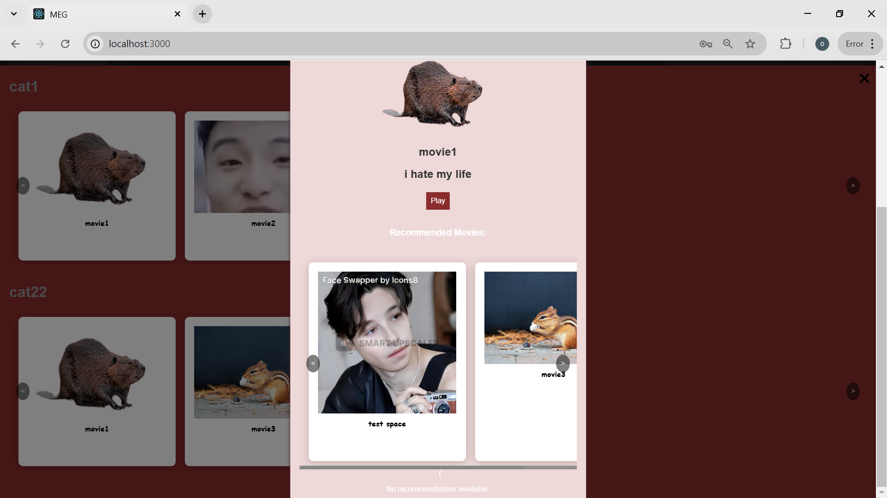
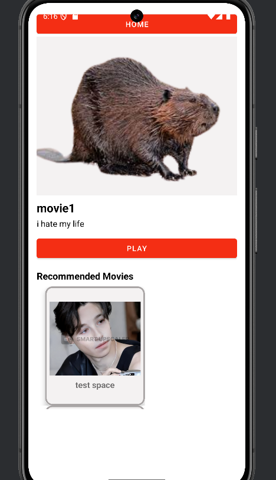
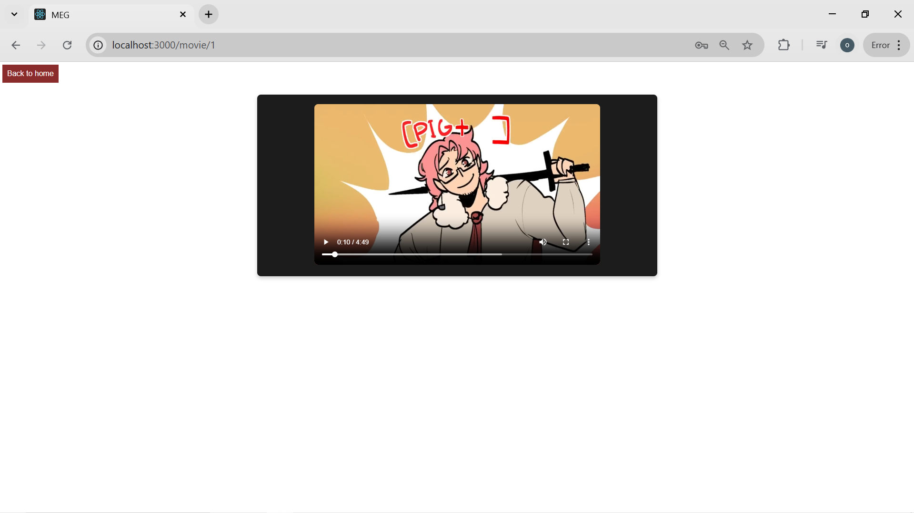
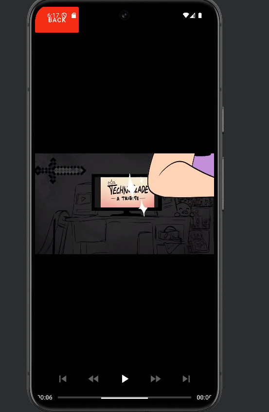

# 📌 Client Instructions  

Follow these steps to navigate through our platform on **Web** and **Android**.  

---

| 🌐 **Web Instructions** | 📱 **Android Instructions** |
|-------------------------|----------------------------|
| ## 🏠 Step 1: Main Page  | ## 🏠 Step 1: Main Page  |
| This is the landing page where guests can explore the platform.  | Guests can browse the main page here. |
|  |  |
| ## 📝 Step 2: Sign-Up  | ## 📝 Step 2: Sign-Up  |
| Create an account to access all features. | Sign up to start using the app. |
|  |  |
| ## 🔑 Step 3: Login  | ## 🔑 Step 3: Login  |
| Log in with your credentials to continue. | Enter your details to log in. |
|  |  |
| ## 🎬 Step 4: Choose a Movie  | ## 🎬 Step 4: Choose a Movie  |
| Browse and select the movie you want to watch. | Pick a movie from the list. |
|  |  |
| ## ▶️ Step 5: Watch Movie  | ## ▶️ Step 5: Watch Movie  |
| Enjoy streaming your selected movie! | Tap play and enjoy watching. |
|  |  |

---