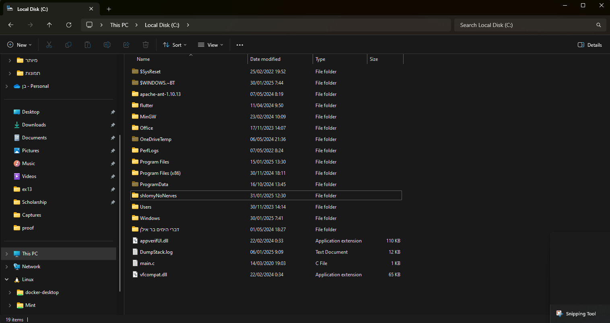
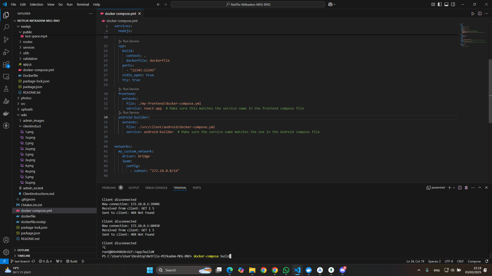
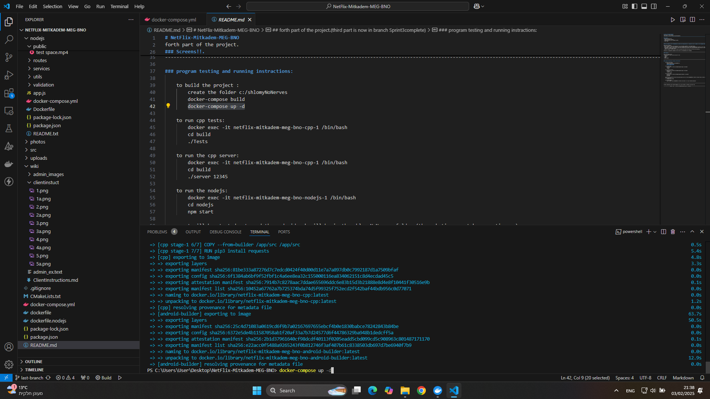
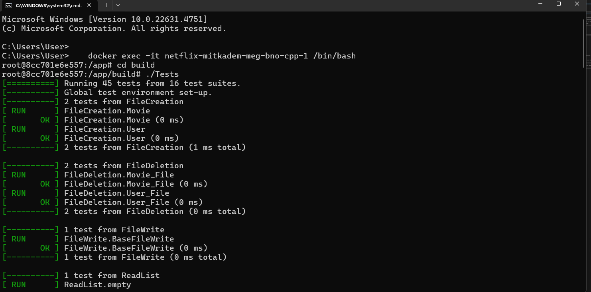
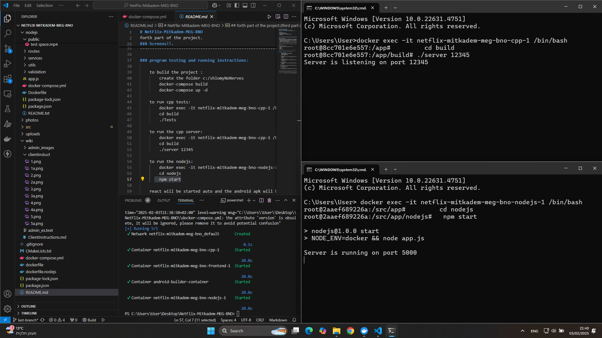
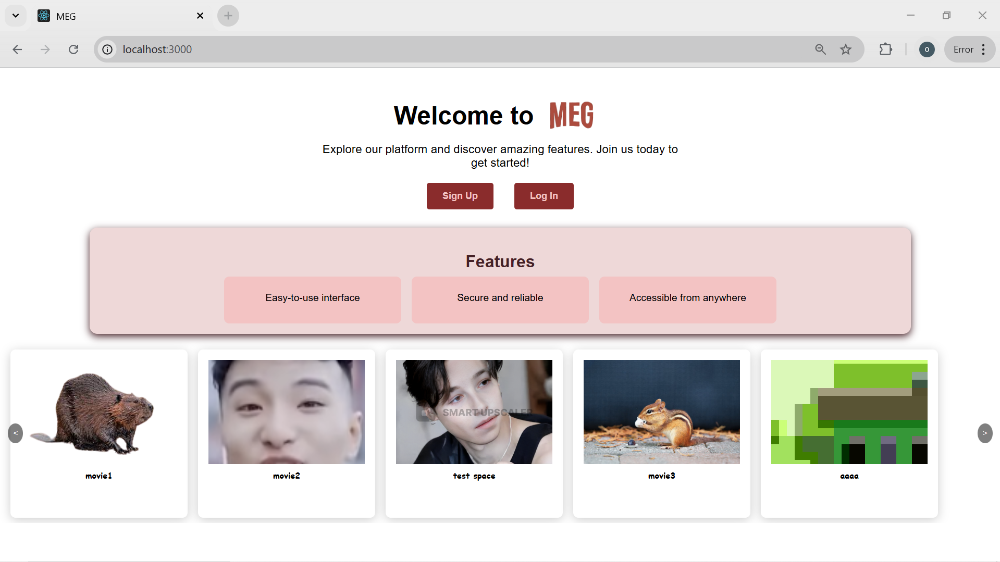
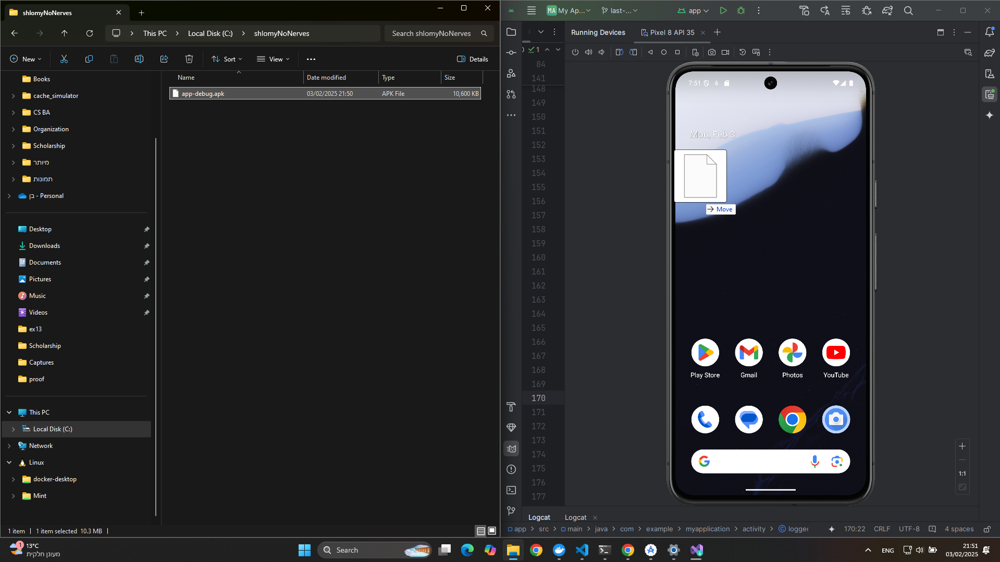
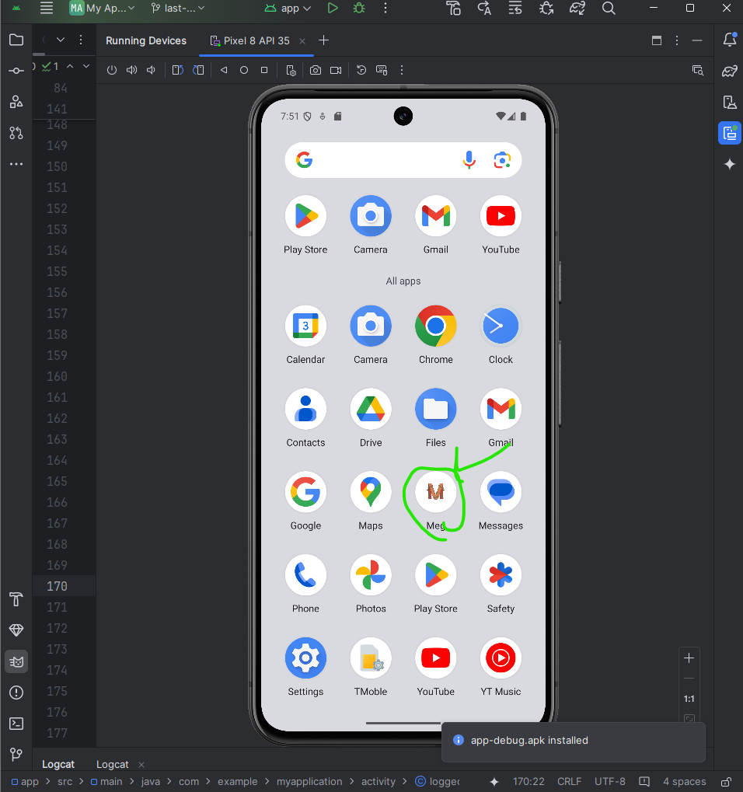
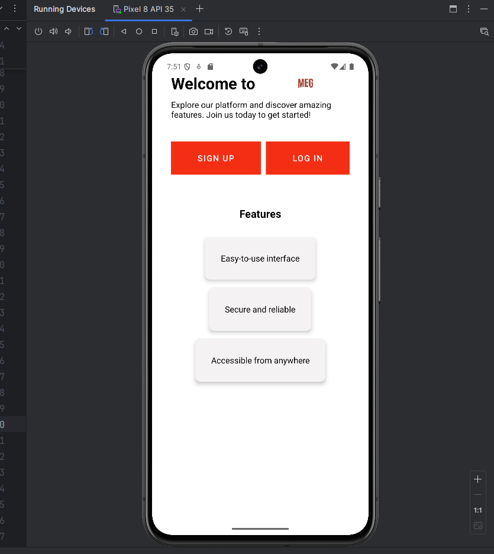

# 📌 Docker  

Follow these steps to use the Docker.  

---

| 🌐 **init all the things** |
|-------------------------|
| ## 🏠 Step 1: initialize  |
| Before running anything make sure your docker, emulator and mongodb is ready then create the folder c:/shlomyNoNerves as below| 
|  |
| Then add the movies you want to displat to NetFlix-Mitkadem-MEG-BNO/nodejs/public folde in this format movietitle.mp4:| 
|  |
| ## 🏠 Step 2: run the docker program  |
| Open a teminal at the main folder of the project at below and run the following commend:| 
| 1. docker-compose build (disclaimer the proccess may take a few minutes!!)| 
|  |
| 2. docker-compose up -d| 
|  |

| 🌐 **Run the program** |
|-------------------------|
| ## 🏠 Step 1: test the cpp  |
| if you want to test the cpp write the next commend on new terminal:| 
| 1. docker exec -it netflix-mitkadem-meg-bno-cpp-1 /bin/bash| 
| 2. cd build| 
| 3. ./Tests| 
|  |
| ## 🏠 Step 2: run the docker servers  |
| To run the cpp and nodejs sever open new two terminals and follow the next step:| 
| **For cpp server:**|
| 1. docker exec -it netflix-mitkadem-meg-bno-cpp-1 /bin/bash| 
| 2. cd build| 
| 3. ./server 12345| 
|  |
| **For nodejs server:**|
| 1. docker exec -it netflix-mitkadem-meg-bno-nodejs-1 /bin/bash| 
| 2. cd nodejs| 
| 3. npm start| 
|  |
| **For React App:**|
| it is running automaticly all you have to do is to open at chrome the next link:|
|http://localhost:3000/|
|  |
| **For Android App:**|
| after you run the step 2 an apk will generate to the folder c:/shlomyNoNerves (this proccess may take few minutes after the compuse-up finish)|
|1. Open the folder c:/shlomyNoNerves and your android emulator and drag the apk to it like that:| 
|  |
|2. now the emultor will install the app and after it you will be able to run it on the emulator like this:|
 |  |
 |  |
|-------------------------|
 | **Enjoy Your Testind!! :)** |
|-------------------------|
---
